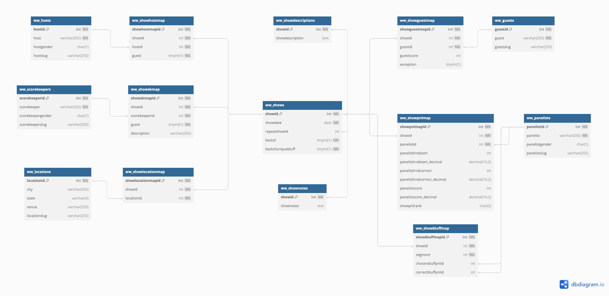

# Wait Wait Don't Tell Me! Stats Database

## Overview

This repository contains the initial database schema for the [Wait Wait Don't Tell Me! Stats Page](https://stats.wwdt.me) database running on either MySQL or MariaDB.

## Requirements

- MySQL Server 8.0 or newer for Wait Wait Stats Database versions 4.0 and higher
- MySQL Server 5.6 or MariaDB Server 10.0 or newer for Wait Wait Stats Database versions below 4.0
- Support for InnoDB enabled for either MySQL Server or MariaDB server

## Installation

This script is designed to be run against a new and empty MySQL or MariaDB database. It can be imported using the `mysql` or `mariadb` command line tool or using any compatible database management tool.

All of the tables are created as InnoDB and use a default charset of `utf8`.

## Database Versions

### Version 4.5 (Current)

The initial database script and database diagram files for version 4.5 of the Stats Page database are located in the `v4.5` directory.

Version 4.5 adds a `showurl` field to the `ww_shows` table that will be used to store URLs for each show page on NPR.org.

Due to issues with trying to generate diagrams using either MySQL Workbench or JetBrains DataGrip, I used [dbdiagram.io](https://dbdiagram.io/) to generate the diagrams for this version of the database. In lieu of a MySQL Workbench diagram file, a DBML representation of the database is included.

### Version 4.4

The initial database script and database diagram files for version 4.4 of the Stats Page database are located in the `v4.4` directory.

Version 4.4 brings support for multiple Bluff the Listener-like segments for each show by adding a new `segment` column to the `ww_showbluffmap` table. The column's default value is `1` and should be incremented for each additional segment for a given show ID.

The new version of the database will be used for upcoming versions of the following projects:

- [wwdtm](https://github.com/questionlp/wwdtm)
- [api.wwdt.me_v2](https://github.com/questionlp/api.wwdt.me_v2)
- [graphs.wwdt.me_v2](https://github.com/questionlp/graphs.wwdt.me_v2)
- [reports.wwdt.me_v2](https://github.com/questionlp/reports.wwdt.me_v2)
- [stats.wwdt.me_v5](https://github.com/questionlp/stats.wwdt.me_v5)

Due to issues with trying to generate diagrams using either MySQL Workbench or JetBrains DataGrip, I used [dbdiagram.io](https://dbdiagram.io/) to generate the diagrams for this version of the database. In lieu of a MySQL Workbench diagram file, a DBML representation of the database is included.

### Version 4.3

The initial database script and database diagram files for version 4.3 of the Stats Page database are located in the `v4.3` directory.

Version 4.3 brings support for storing panelist starting scores and correct answers as decimal values by way of the new `panelistlrndstart_decimal` and `panelistlrndcorrect_decimal` columns in the `ww_showpnlmap` table.

### Version 4.2

The initial database script and database diagram files for version 4.2 of the Stats Page database are located in the `v4.2` directory.

Version 4.2 brings support for storing panelist scores as a decimal value by way of the new `panelistscore_decimal` column in the `ww_showpnlmap` table.

### Version 4.1

The initial database script and database diagram files for version 4.1 of the Stats Page database are located in the `v4.1` directory.

Version 4.1 brings the database, tables and all text columns to use the `utf8mb4` character set and `utf8mb4_unicode_ci` collation instead of `utf8` and `utf8_general_ci` used in prior versions. The change in character set did not require any changes in column data types, sizes or indexes.

This version of the database corresponds with the current versions of the following Wait Wait... Don't Tell Me! projects.

- Active Projects
  - [wwdtm](https://github.com/questionlp/wwdtm)
  - [api.wwdt.me_v2](https://github.com/questionlp/api.wwdt.me_v2)
  - [graphs.wwdt.me_v2](https://github.com/questionlp/graphs.wwdt.me_v2)
  - [reports.wwdt.me_v2](https://github.com/questionlp/reports.wwdt.me_v2)
  - [stats.wwdt.me_v5](https://github.com/questionlp/stats.wwdt.me_v5)
  - [wwdtm_slugify](https://github.com/questionlp/wwdtm_slugify)
- Archived or Deprecated Projects
  - [libwwdtm](https://github.com/questionlp/libwwdtm)
  - [api.wwdt.me](https://github.com/questionlp/api.wwdt.me)
  - [graphs.wwdt.me](https://github.com/questionlp/graphs.wwdt.me)
  - [reports.wwdt.me](https://github.com/questionlp/reports.wwdt.me)
  - [stats.wwdt.me](https://github.com/questionlp/stats.wwdt.me)

### Version 4

The initial database script and database diagram files for version 4 of the Stats Page database are located in the `v4` directory.

Version 4 of the database sheds all of the views that were created for previous versions of the database and the Stats Page.

### Version 3

The initial database script and database diagram files for version 4 of the Stats Page database are located in the `v3` directory.

This version of the database corresponds with the legacy versions of the Wait Wait... Don't Tell Me! Stats Page web application:

- [wwdtm_v2](https://github.com/questionlp/wwdt.me_v2)
- [wwdtm_v3](https://github.com/questionlp/wwdt.me_v3)

The database diagram for the database was generated using [MySQL Workbench](https://www.mysql.com/products/workbench/):

## Contributing

If you would like contribute to this project, please make sure to review both the [Code of Conduct](CODE_OF_CONDUCT.md) and the [Contributing](CONTRIBUTING.md) documents in this repository.

## License

The database script and schema are licensed under the terms of the [Apache License 2.0](http://www.apache.org/licenses/LICENSE-2.0).
