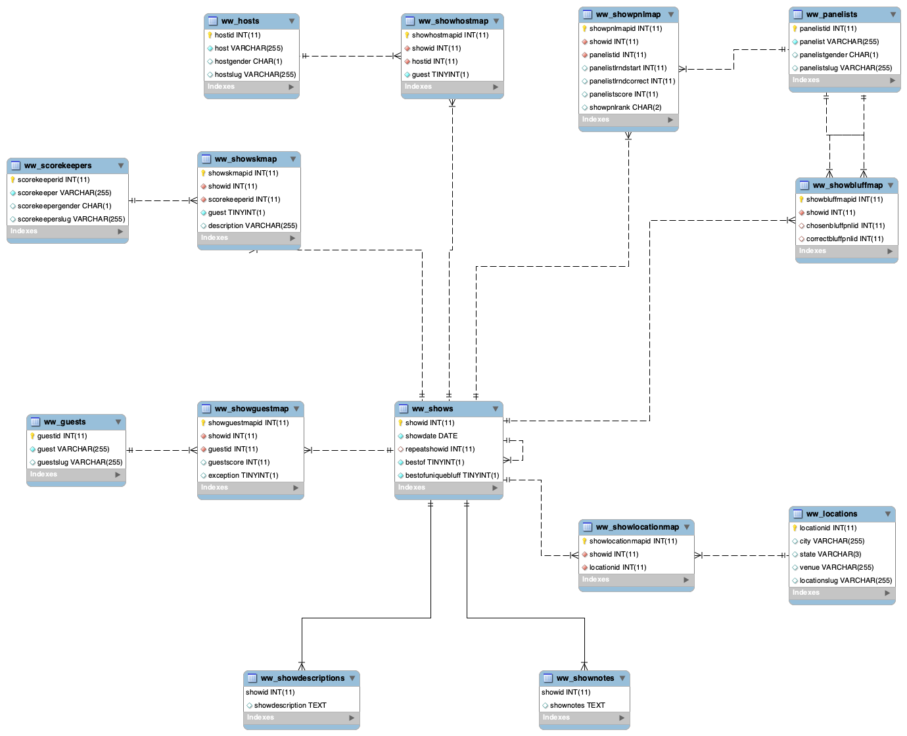

# Wait Wait Don't Tell Me! Stats Page Database

## Overview

This repository contains the initial database schema for the
[Wait Wait Don't Tell Me! Stats Page](https://stats.wwdt.me)
database running on either MySQL or MariaDB.

## Requirements

- MySQL Server 5.6 or MariaDB Server 10.0 or newer
- Support for InnoDB enabled for either MySQL Server or MariaDB server

## Installation

This script is designed to be run against a new and empty MySQL or MariaDB
database. It can be imported using the `mysql` or `mariadb` command line
tool or using any compatible database management tool.

All of the tables are created as InnoDB and use a default charset of `utf8`.

## Database Versions

### Version 4 (Current)

The initial database script and database diagram files for version 4 of the
Stats Page database are located in the `v4` directory.

This version of the database corresponds with the current versions of the
following Wait Wait... Don't Tell Me! projects.

- [libwwdtm](https://github.com/questionlp/libwwdtm)
- [api.wwdt.me](https://github.com/questionlp/api.wwdt.me)
- [graphs.wwdt.me](https://github.com/questionlp/graphs.wwdt.me)
- [reports.wwdt.me](https://github.com/questionlp/reports.wwdt.me)
- [stats.wwdt.me](https://github.com/questionlp/stats.wwdt.me)
- [wwdtm_slugify](https://github.com/questionlp/wwdtm_slugify)

The database diagram for the database was generated using
[MySQL Workbench](https://www.mysql.com/products/workbench/):

### Version 3

The initial database script and database diagram files for version 4 of the
Stats Page database are located in the `v3` directory.

This version of the database corresponds with the legacy versions of the Wait
Wait... Don't Tell Me! Stats Page web application:

- [wwdtm_v2](https://github.com/questionlp/wwdt.me_v2)
- [wwdtm_v3](https://github.com/questionlp/wwdt.me_v3)

The database diagram for the database was generated using
[MySQL Workbench](https://www.mysql.com/products/workbench/):

## Contributing

If you would like contribute to this project, please make sure to review both
the [Code of Conduct](CODE_OF_CONDUCT.md) and the
[Contributing](CONTRIBUTING.md) documents in this repository.

## License

The database script and schema are licensed under the terms of the
[Apache License 2.0](http://www.apache.org/licenses/LICENSE-2.0).
